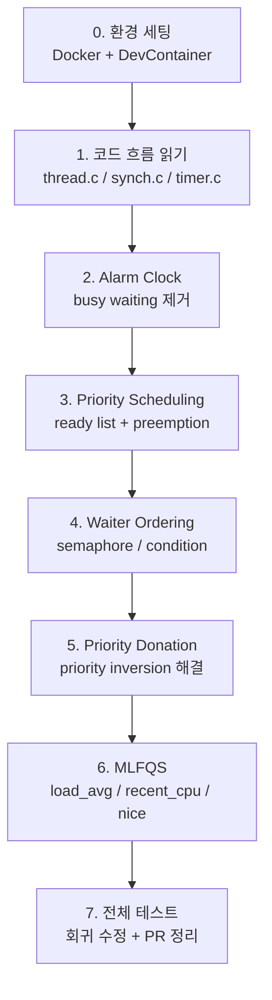
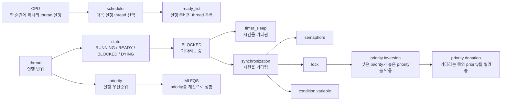

# Pintos Project 1 학습가이드 로드맵

이 문서는 Week 9 Pintos `PROJECT 1: Threads`를 처음 접하는 팀원이 **무엇을 이해하고, 어떤 순서로 구현하고, 어떤 테스트로 확인할지**를 따라가기 위한 학습 가이드입니다.

대상 독자는 OS를 처음 배우는 학생, 비전공자, C와 자료구조는 배웠지만 커널 코드를 처음 읽는 사람입니다. 그래서 이 문서는 바로 구현부터 들어가지 않고, **개념 -> 코드 위치 -> 구현 목표 -> 테스트 이름 -> 실패 시 의심 지점** 순서로 설명합니다.

---

## 0. 이 가이드의 자체 검토 기준

이 문서는 "OS를 처음 접하는 사람이 따라갈 수 있는가?"를 기준으로 다시 검토했습니다.

| 기준 | 결과 | 문서에서 확인할 위치 |
|---|---|---|
| OS 초심자가 오늘 무엇부터 읽어야 하는지 알 수 있다 | 통과 | 요일별 `읽을 것`, `개념 체크` |
| 각 기능이 실제 Pintos 테스트와 연결된다 | 통과 | `5. 테스트 이름 기준 구현 지도` |
| 테스트 실패 시 의심할 파일과 개념을 알 수 있다 | 통과 | 각 요일의 `실패 시 의심 순서` |
| 단순 구현 순서가 아니라 왜 이 순서인지 설명한다 | 통과 | `2. 전체 로드맵 그림`, `12. 비판적 사고` |
| 매일 끝났을 때 스스로 점검할 질문이 있다 | 통과 | `개념 체크`, `10. 초심자용 디버깅 질문` |
| 팀 PR 리뷰에서 사용할 설명 문장이 있다 | 통과 | `8. PR 리뷰용 설명 템플릿` |

---

## 1. 이번 주 목표

### 학습 목표

- 커널 수준 스레드의 생성, 실행, block, unblock, scheduling 흐름을 이해한다.
- race condition을 막기 위한 semaphore, lock, condition variable의 의미를 코드로 확인한다.
- priority scheduling과 priority donation으로 priority inversion 문제를 해결한다.
- MLFQS를 구현하면서 scheduler가 CPU 사용량과 nice 값을 반영하는 방식을 이해한다.

### 구현 목표

- `PROJECT 1: Threads`의 필수 테스트를 통과한다.
- 팀원별 branch에서 작업하고, 매일 코어타임에 PR 리뷰 후 팀 main/master branch에 병합한다.
- 구현이 끝난 뒤에는 각 기능이 어떤 invariant를 보장하는지 설명할 수 있어야 한다.

### 채점 비중 기준

레포의 `pintos/tests/threads/Grading` 기준으로 Project 1은 아래 비중으로 나뉩니다.

| 영역 | 비중 | 핵심 구현 |
|---|---:|---|
| Alarm | 20% | busy waiting 없는 `timer_sleep()` |
| Priority | 50% | priority scheduling, donation, synchronization waiters |
| MLFQS | 30% | 4.4BSD-style scheduler |

이 비중 때문에 학습 시간도 **Priority/Donation에 가장 많이 배정**해야 합니다.

---

## 2. 전체 로드맵 그림

앞 단계가 흔들리면 뒤 단계 테스트가 연쇄적으로 깨집니다. 특히 donation은 priority scheduling이 안정된 뒤에 들어가야 디버깅이 가능합니다.



---

## 3. 초심자를 위한 OS 개념 지도

처음 Pintos를 보면 `thread`, `interrupt`, `semaphore`, `lock`, `schedule`이 한꺼번에 나와서 헷갈립니다. 아래 관계부터 잡으면 코드가 훨씬 덜 무섭습니다.



초심자용 해석:

- thread는 "실행 흐름"입니다.
- scheduler는 "다음에 누구를 실행할지 고르는 코드"입니다.
- ready list는 "실행될 준비가 된 thread들의 줄"입니다.
- blocked는 "아직 실행될 수 없어서 기다리는 상태"입니다.
- lock은 "한 번에 한 thread만 들어갈 수 있는 문"입니다.
- priority donation은 "문을 잡고 있는 낮은 priority thread를 잠깐 높여서 빨리 문을 놓게 하는 장치"입니다.
- MLFQS는 "priority를 사람이 직접 주는 대신 CPU 사용량과 nice 값으로 계속 계산하는 scheduler"입니다.

---

## 4. 핵심 파일 지도

| 파일 | 먼저 볼 함수/구조체 | 이번 주 역할 |
|---|---|---|
| `pintos/threads/thread.c` | `thread_create`, `thread_unblock`, `thread_yield`, `schedule`, `next_thread_to_run` | scheduler의 중심 |
| `pintos/threads/thread.h` | `struct thread` | priority, donation, MLFQS 필드 추가 |
| `pintos/threads/synch.c` | `sema_down`, `sema_up`, `lock_acquire`, `lock_release`, `cond_wait`, `cond_signal` | synchronization과 donation 구현 |
| `pintos/threads/synch.h` | `struct semaphore`, `struct lock`, `struct condition` | waiters와 holder 구조 확인 |
| `pintos/devices/timer.c` | `timer_sleep`, `timer_interrupt` | Alarm Clock 구현 |
| `pintos/lib/kernel/list.c` | `list_insert_ordered`, `list_sort`, `list_entry` | Pintos list 사용법 |
| `pintos/lib/kernel/list.h` | `struct list_elem`, list macro | intrusive list 이해 |

---

## 5. 테스트 이름 기준 구현 지도

아래 표는 실제 레포의 `pintos/tests/threads` 테스트 이름을 기준으로 정리한 것입니다.

### Alarm 테스트

| 테스트 | 검증하는 것 | 주로 의심할 파일 |
|---|---|---|
| `alarm-single` | 한 thread가 지정 tick 이후 깨어나는가 | `timer.c` |
| `alarm-multiple` | 여러 thread가 각자 다른 시간에 깨어나는가 | `timer.c`, sleep list 정렬 |
| `alarm-simultaneous` | 같은 tick에 잠든 thread들이 모두 깨어나는가 | `timer.c`, list 순회/삭제 |
| `alarm-priority` | 깨어난 뒤 priority scheduling이 유지되는가 | `timer.c`, `thread.c` |
| `alarm-zero` | 0 tick sleep을 안전하게 처리하는가 | `timer_sleep` edge case |
| `alarm-negative` | 음수 tick sleep을 안전하게 처리하는가 | `timer_sleep` edge case |

### Priority / Donation 테스트

| 테스트 | 검증하는 것 | 주로 의심할 파일 |
|---|---|---|
| `priority-change` | priority 변경 후 필요한 경우 yield 되는가 | `thread_set_priority`, `thread_yield` |
| `priority-fifo` | 같은 priority에서는 순서가 이상하게 깨지지 않는가 | `ready_list` 관리 |
| `priority-preempt` | 더 높은 priority thread가 생기면 즉시 선점하는가 | `thread_unblock`, `thread_create` |
| `priority-sema` | semaphore waiters 중 highest priority가 먼저 깨어나는가 | `sema_down`, `sema_up` |
| `priority-condvar` | condition waiters 중 highest priority가 먼저 signal 되는가 | `cond_wait`, `cond_signal` |
| `priority-donate-one` | lock 하나에 대한 기본 donation이 되는가 | `lock_acquire`, `lock_release` |
| `priority-donate-multiple` | 여러 donor 중 최고 priority가 반영되는가 | donation list 관리 |
| `priority-donate-multiple2` | 여러 lock/donor 상황에서도 복구가 맞는가 | donation 제거/재계산 |
| `priority-donate-nest` | nested donation이 전파되는가 | waiting lock chain |
| `priority-donate-chain` | 긴 donation chain이 전파되는가 | donation depth, chain traversal |
| `priority-donate-sema` | lock holder가 semaphore에서 block된 상황도 처리되는가 | donation 유지, sema wait |
| `priority-donate-lower` | donation 중 base priority를 낮춰도 effective priority가 유지되는가 | `thread_set_priority`, release 복구 |

### MLFQS 테스트

| 테스트 | 검증하는 것 | 주로 의심할 파일 |
|---|---|---|
| `mlfqs-load-1` | thread 1개 수준의 `load_avg` 계산 | `thread.c`, fixed-point |
| `mlfqs-load-60` | 많은 thread에서 `load_avg` 변화 | ready thread count |
| `mlfqs-load-avg` | 장시간 `load_avg` 추세 | 1초 단위 update |
| `mlfqs-recent-1` | `recent_cpu` 계산 | formula, rounding |
| `mlfqs-fair-2` | 2개 thread의 CPU 분배 공정성 | priority 재계산 |
| `mlfqs-fair-20` | 20개 thread의 CPU 분배 공정성 | priority 재계산, ready count |
| `mlfqs-nice-2` | nice 값 2종류에서 priority 차이 | `thread_set_nice` |
| `mlfqs-nice-10` | nice 값 10종류에서 priority 차이 | nice 반영식 |
| `mlfqs-block` | block된 thread가 계산에 잘 반영되는가 | blocked thread 처리 |

---

## 6. 테스트 실행 루틴

컨테이너 안에서 실행하는 것을 기준으로 합니다.

```bash
cd pintos/threads
make
make check
```

개별 테스트는 보통 아래 형태로 실행합니다.

```bash
make tests/threads/alarm-single.result
make tests/threads/priority-preempt.result
make tests/threads/priority-donate-chain.result
make tests/threads/mlfqs/mlfqs-load-1.result
```

테스트를 볼 때는 "통과/실패"만 보지 말고 아래처럼 분류합니다.

| 실패 유형 | 먼저 의심할 것 |
|---|---|
| 기대한 thread 출력 순서가 다름 | priority 정렬, yield 타이밍 |
| thread가 안 깨어남 | sleep list, wakeup tick, timer interrupt |
| donation 테스트 일부만 실패 | donation 제거, multiple donor, nested chain |
| MLFQS 숫자가 조금 다름 | fixed-point rounding, update 주기 |
| 전체가 멈춤 | interrupt disable 범위, list 순회 중 삭제, deadlock |

---

## 7. 요일별 체크리스트

## 금요일 2026-04-24: 환경 세팅 + 코드 흐름 + Alarm Clock

### 오늘의 목표

Pintos가 thread를 어떻게 실행하고 멈추는지 이해한 뒤, busy waiting 없는 `timer_sleep()`을 구현합니다.

### 읽을 것

- KAIST Project 1 Introduction
- KAIST Appendix: Threads
- KAIST Appendix: Synchronization
- `Pintos_1.pdf`
  - scheduler concept
  - Pintos scheduler
  - `list_entry`
  - priority scheduling 맛보기

### 개념 체크

- [ ] thread state 4개를 말할 수 있다: `RUNNING`, `READY`, `BLOCKED`, `DYING`
- [ ] `thread_block()`은 왜 직접 ready list에 넣지 않는지 설명할 수 있다.
- [ ] `thread_unblock()`이 thread를 어디에 넣는지 설명할 수 있다.
- [ ] `timer_sleep()`에서 busy waiting이 왜 나쁜지 설명할 수 있다.

### 코드 체크

- [ ] VSCode에서 DevContainer로 프로젝트 열기
- [ ] 컨테이너 터미널에서 Pintos activate가 적용되는지 확인
- [ ] `pintos/threads`에서 `make` 실행
- [ ] `make check`를 한 번 실행해서 현재 실패 테스트 확인
- [ ] `thread_create()` 흐름 읽기
- [ ] `thread_unblock()` 흐름 읽기
- [ ] `thread_yield()` 흐름 읽기
- [ ] `schedule()`과 `next_thread_to_run()` 흐름 읽기
- [ ] `timer_sleep()` 기존 구현이 왜 busy waiting인지 코드로 확인
- [ ] sleeping thread를 저장할 자료구조 설계
- [ ] timer interrupt에서 깨울 thread를 찾는 방식 정하기
- [ ] Alarm Clock 구현

### 오늘 목표 테스트

- [ ] `alarm-single`
- [ ] `alarm-multiple`
- [ ] `alarm-simultaneous`
- [ ] `alarm-zero`
- [ ] `alarm-negative`

### 오늘의 추가 테스트

- [ ] `alarm-priority`

`alarm-priority`는 priority scheduling이 완성되기 전에는 실패할 수 있습니다. 금요일에는 실패해도 괜찮지만, 실패 이유를 기록해야 합니다.

### 실패 시 의심 순서

1. sleep list에 들어간 thread의 wakeup tick이 맞는가?
2. timer interrupt에서 tick이 지난 thread를 모두 깨우는가?
3. list 순회 중 remove를 안전하게 하고 있는가?
4. `timer_sleep(0)`과 음수 tick을 block하지 않고 처리하는가?

---

## 토요일 2026-04-25: Priority Scheduling 기본

### 오늘의 목표

항상 가장 높은 priority를 가진 thread가 먼저 실행되도록 scheduler와 synchronization waiters를 수정합니다.

### 읽을 것

- KAIST Project 1: Priority Scheduling
- `pintos/threads/thread.c`
- `pintos/threads/synch.c`
- `pintos/lib/kernel/list.c`

### 개념 체크

- [ ] Pintos priority는 숫자가 클수록 높은 우선순위임을 알고 있다.
- [ ] ready list는 "실행 가능한 thread들의 줄"이라고 설명할 수 있다.
- [ ] preemption이 "현재 thread가 자발적으로 끝나기 전에 CPU를 넘기는 것"임을 설명할 수 있다.
- [ ] semaphore waiters와 condition waiters도 priority를 고려해야 하는 이유를 설명할 수 있다.

### 코드 체크

- [ ] `ready_list`를 priority 기준으로 관리할지, 선택 시 정렬할지 결정
- [ ] `thread_unblock()` 후 더 높은 priority thread가 생기면 preemption 되는지 확인
- [ ] `thread_create()` 직후 새 thread가 더 높으면 yield 처리
- [ ] `thread_set_priority()` 기본 동작 구현
- [ ] `thread_get_priority()` 구현 확인
- [ ] `sema_down()`에서 waiters에 들어가는 흐름 읽기
- [ ] `sema_up()`에서 가장 높은 priority waiter를 깨우도록 수정
- [ ] `cond_wait()` / `cond_signal()` 흐름 읽기
- [ ] condition variable waiters도 priority 기준으로 깨우도록 수정

### 오늘 목표 테스트

- [ ] `priority-change`
- [ ] `priority-fifo`
- [ ] `priority-preempt`
- [ ] `priority-sema`
- [ ] `priority-condvar`
- [ ] `alarm-priority`

### 실패 시 의심 순서

1. `ready_list`에서 highest priority가 먼저 선택되는가?
2. 새 thread가 ready 상태가 된 직후 현재 thread가 yield해야 하는 상황인가?
3. `sema_up()`이 FIFO가 아니라 highest priority waiter를 깨우는가?
4. `cond_signal()`이 condition waiter 내부의 semaphore priority까지 고려하는가?
5. `thread_set_priority()` 후 현재 thread보다 높은 ready thread가 있으면 yield하는가?

---

## 월요일 2026-04-27: Priority Donation

### 오늘의 목표

priority inversion을 lock 기반 donation으로 해결합니다. Project 1에서 가장 디버깅이 오래 걸릴 수 있는 구간입니다.

### 읽을 것

- KAIST Project 1: Priority Donation 설명
- `pintos/threads/synch.c`의 `lock_acquire()`, `lock_release()`
- `pintos/threads/thread.h`의 `struct thread`

### 개념 체크

- [ ] priority inversion 상황을 예시로 설명할 수 있다.
- [ ] donation은 lock 소유 관계에서 발생한다는 점을 설명할 수 있다.
- [ ] base priority와 effective priority를 구분할 수 있다.
- [ ] multiple donation과 nested donation의 차이를 설명할 수 있다.

### 코드 체크

- [ ] `struct thread`에 base/original priority 필드 설계
- [ ] `struct thread`에 donation 목록 또는 donation 계산 근거 설계
- [ ] `struct thread`에 현재 기다리는 lock 정보를 둘지 결정
- [ ] `struct lock`의 holder를 기준으로 누구에게 donation할지 정리
- [ ] `lock_acquire()`에서 holder에게 priority donation 구현
- [ ] nested donation이 lock chain을 따라 전파되도록 구현
- [ ] multiple donation에서 가장 높은 donation을 유지하도록 구현
- [ ] `lock_release()`에서 해당 lock과 관련된 donation만 제거
- [ ] donation 제거 후 남은 donation과 base priority 중 최고값으로 복구
- [ ] donation 상태에서 `thread_set_priority()` 동작 정리
- [ ] `thread_mlfqs == true`일 때 donation이 실행되지 않도록 분리

### 오늘 목표 테스트

- [ ] `priority-donate-one`
- [ ] `priority-donate-multiple`
- [ ] `priority-donate-multiple2`
- [ ] `priority-donate-nest`
- [ ] `priority-donate-chain`
- [ ] `priority-donate-sema`
- [ ] `priority-donate-lower`

### 실패 시 의심 순서

1. lock을 기다리는 thread가 lock holder에게 donation하는가?
2. holder가 이미 다른 lock을 기다리고 있다면 donation이 chain을 따라 전파되는가?
3. lock release 시 해당 lock과 관련된 donation만 제거하는가?
4. donation 제거 후 남은 donor 중 최고 priority를 다시 계산하는가?
5. donation을 받은 상태에서 `thread_set_priority()`가 effective priority를 잘못 낮추지 않는가?
6. donation 후 ready list 정렬 또는 yield가 다시 필요한 상황을 처리하는가?

---

## 화요일 2026-04-28: MLFQS

### 오늘의 목표

`-mlfqs` 옵션에서 4.4BSD-style scheduler가 동작하도록 `load_avg`, `recent_cpu`, `nice`, priority 계산을 구현합니다.

### 읽을 것

- KAIST Project 1: Advanced Scheduler
- 공식 문서의 fixed-point arithmetic 설명
- `thread_mlfqs`가 어디에서 설정되고 사용되는지

### 개념 체크

- [ ] kernel에서 floating point를 쓰면 안 되는 이유를 설명할 수 있다.
- [ ] `nice`가 높을수록 priority가 낮아지는 이유를 설명할 수 있다.
- [ ] `recent_cpu`가 CPU를 많이 쓴 thread를 낮추는 방향으로 작동함을 설명할 수 있다.
- [ ] `load_avg`가 ready thread 수의 장기 평균임을 설명할 수 있다.

### 코드 체크

- [ ] fixed-point helper 함수 또는 매크로 작성
- [ ] `nice` 필드 추가
- [ ] `recent_cpu` 필드 추가
- [ ] 전역 `load_avg` 추가
- [ ] 매 tick마다 running thread의 `recent_cpu` 증가
- [ ] 매 4 ticks마다 모든 thread priority 재계산
- [ ] 매 1초마다 `load_avg` 재계산
- [ ] 매 1초마다 모든 thread의 `recent_cpu` 재계산
- [ ] `thread_get_nice()` 구현
- [ ] `thread_set_nice()` 구현
- [ ] `thread_get_recent_cpu()` 구현
- [ ] `thread_get_load_avg()` 구현
- [ ] `thread_mlfqs == true`일 때 직접 priority 설정과 donation이 섞이지 않게 분리

### 오늘 목표 테스트

- [ ] `mlfqs-load-1`
- [ ] `mlfqs-load-60`
- [ ] `mlfqs-load-avg`
- [ ] `mlfqs-recent-1`
- [ ] `mlfqs-fair-2`
- [ ] `mlfqs-fair-20`
- [ ] `mlfqs-nice-2`
- [ ] `mlfqs-nice-10`
- [ ] `mlfqs-block`

### 실패 시 의심 순서

1. fixed-point 변환과 반올림이 공식 문서와 일치하는가?
2. `load_avg` 계산 시 idle thread를 ready thread 수에 넣지 않았는가?
3. `recent_cpu`가 매 tick마다 running thread에만 증가하는가?
4. 4 ticks마다 priority를 재계산하는가?
5. `TIMER_FREQ`마다 `load_avg`와 모든 thread의 `recent_cpu`를 재계산하는가?
6. MLFQS 모드에서 donation 또는 직접 priority 설정이 섞이지 않는가?

---

## 수요일 2026-04-29: 전체 테스트 + 회귀 수정 + PR 정리

### 오늘의 목표

새 기능을 더 넣기보다, 전체 테스트를 돌리고 실패 원인을 분류해서 팀 코드로 병합 가능한 상태를 만듭니다.

### 전체 테스트 체크리스트

Alarm:

- [ ] `alarm-single`
- [ ] `alarm-multiple`
- [ ] `alarm-simultaneous`
- [ ] `alarm-priority`
- [ ] `alarm-zero`
- [ ] `alarm-negative`

Priority:

- [ ] `priority-change`
- [ ] `priority-fifo`
- [ ] `priority-preempt`
- [ ] `priority-sema`
- [ ] `priority-condvar`

Donation:

- [ ] `priority-donate-one`
- [ ] `priority-donate-multiple`
- [ ] `priority-donate-multiple2`
- [ ] `priority-donate-nest`
- [ ] `priority-donate-chain`
- [ ] `priority-donate-sema`
- [ ] `priority-donate-lower`

MLFQS:

- [ ] `mlfqs-load-1`
- [ ] `mlfqs-load-60`
- [ ] `mlfqs-load-avg`
- [ ] `mlfqs-recent-1`
- [ ] `mlfqs-fair-2`
- [ ] `mlfqs-fair-20`
- [ ] `mlfqs-nice-2`
- [ ] `mlfqs-nice-10`
- [ ] `mlfqs-block`

### 회귀 점검

- [ ] 최근 수정이 이전 테스트를 깨뜨렸는지 확인
- [ ] list ordering 관련 assertion 점검
- [ ] interrupt disable 범위가 과도하지 않은지 확인
- [ ] `thread_yield()` 호출 위치가 interrupt context와 충돌하지 않는지 확인
- [ ] MLFQS 모드와 기본 priority scheduler 모드가 섞이지 않는지 확인
- [ ] PR 단위로 변경 파일 정리
- [ ] PR 설명에 구현한 invariant 작성
- [ ] 팀원 리뷰 후 main 또는 master에 병합
- [ ] 병합 후 전체 테스트 다시 실행

---

## 8. PR 리뷰용 설명 템플릿

### Alarm PR 예시

```markdown
## 변경 내용
- `timer_sleep()` busy waiting 제거
- sleep list를 wakeup tick 기준으로 관리
- timer interrupt에서 wakeup tick이 지난 thread를 unblock

## 보장하는 invariant
- sleeping thread는 wakeup tick 전에는 ready list에 들어가지 않는다.
- timer interrupt는 wakeup 대상 thread만 unblock한다.

## 테스트
- alarm-single
- alarm-multiple
- alarm-simultaneous
- alarm-zero
- alarm-negative
```

### Priority PR 예시

```markdown
## 변경 내용
- ready list를 priority 기준으로 관리
- higher priority thread가 ready 상태가 되면 현재 thread가 yield
- semaphore/condition waiters를 priority 기준으로 깨움

## 보장하는 invariant
- ready 상태인 thread 중 priority가 가장 높은 thread가 먼저 실행된다.
- synchronization primitive에서 깨어나는 thread도 priority 순서를 따른다.

## 테스트
- priority-change
- priority-fifo
- priority-preempt
- priority-sema
- priority-condvar
- alarm-priority
```

### Donation PR 예시

```markdown
## 변경 내용
- lock holder에게 priority donation 적용
- multiple/nested donation 처리
- lock release 시 관련 donation 제거 후 effective priority 재계산

## 보장하는 invariant
- 높은 priority thread가 lock 때문에 block되면 lock holder는 필요한 동안 그 priority를 반영한다.
- lock release 후에는 남은 donation과 base priority를 기준으로 priority가 복구된다.

## 테스트
- priority-donate-one
- priority-donate-multiple
- priority-donate-multiple2
- priority-donate-nest
- priority-donate-chain
- priority-donate-sema
- priority-donate-lower
```

### MLFQS PR 예시

```markdown
## 변경 내용
- fixed-point 연산 helper 추가
- load_avg, recent_cpu, nice 기반 priority 계산 구현
- -mlfqs 모드에서 donation/direct priority 설정과 분리

## 보장하는 invariant
- MLFQS 모드에서는 priority가 공식 계산식과 tick 주기에 의해 갱신된다.
- idle thread는 load_avg와 recent_cpu 계산에서 제외된다.

## 테스트
- mlfqs-load-1
- mlfqs-load-60
- mlfqs-load-avg
- mlfqs-recent-1
- mlfqs-fair-2
- mlfqs-fair-20
- mlfqs-nice-2
- mlfqs-nice-10
- mlfqs-block
```

---

## 9. 매일 공통 루틴

매일 작업을 시작할 때:

- [ ] 현재 branch 확인
- [ ] 팀 main/master 최신 변경 반영
- [ ] 전날 통과한 테스트가 아직 통과하는지 확인
- [ ] 오늘 구현할 기능의 공식 문서 다시 읽기
- [ ] 수정할 파일과 건드리지 않을 파일 구분

매일 작업을 끝낼 때:

- [ ] 통과한 테스트 이름 기록
- [ ] 실패한 테스트 이름과 실패 메시지 기록
- [ ] 오늘 알게 된 scheduler invariant 한 줄로 정리
- [ ] PR 또는 커밋 메시지를 기능 단위로 작성
- [ ] 팀원에게 리뷰받을 질문 1개 이상 적기

---

## 10. 초심자용 디버깅 질문

테스트가 깨졌을 때 바로 코드를 고치지 말고 아래 질문부터 답합니다.

- 지금 실행되어야 하는 thread는 누구인가?
- 그 thread는 `READY`인가, `BLOCKED`인가?
- ready list에 들어간 순서와 priority가 맞는가?
- 지금 비교해야 하는 대상은 `struct thread`인가, `struct semaphore_elem`인가?
- interrupt를 꺼야 하는 이유가 shared data 보호 때문인가?
- `thread_yield()`를 interrupt context에서 직접 호출하고 있지 않은가?
- donation을 받은 priority와 원래 priority를 구분하고 있는가?
- lock release 후 남아 있는 donation을 버리지 않았는가?
- MLFQS 모드에서 donation 코드가 실행될 가능성은 없는가?
- 숫자 테스트가 조금씩 틀린다면 fixed-point rounding 위치가 맞는가?

---

## 11. 테스트 기록 템플릿

아래 표를 복사해서 매일 PR 설명이나 개인 기록에 붙여 쓰면 좋습니다.

| 날짜 | 기능 | 통과 테스트 | 실패 테스트 | 원인 추정 | 다음 액션 |
|---|---|---|---|---|---|
| 2026-04-24 | Alarm Clock |  |  |  |  |
| 2026-04-25 | Priority Scheduling |  |  |  |  |
| 2026-04-27 | Priority Donation |  |  |  |  |
| 2026-04-28 | MLFQS |  |  |  |  |
| 2026-04-29 | 전체 회귀 |  |  |  |  |

---

## 12. 비판적 사고로 본 기존 로드맵의 보완점

기존 로드맵은 구현 순서는 맞았지만, OS 초심자가 따라가기에는 몇 가지 약점이 있었습니다.

| 기존 약점 | 왜 문제인가 | 이번 문서에서 고친 방식 |
|---|---|---|
| 테스트 이름이 부족함 | 어떤 테스트가 어떤 기능을 검증하는지 알기 어려움 | 실제 테스트 이름별 구현 지도 추가 |
| 개념 진입부가 짧음 | 비전공자는 thread, scheduler, blocked 상태부터 막힘 | 초심자용 OS 개념 지도 추가 |
| 실패 시 행동이 모호함 | 테스트 실패 후 무작정 코드 수정으로 흐를 수 있음 | 실패 시 의심 순서 추가 |
| PR 리뷰 기준이 약함 | 팀 병합 때 설명이 기능 나열에 그칠 수 있음 | invariant 중심 PR 템플릿 추가 |
| MLFQS와 donation 분리 강조 부족 | 두 scheduler 정책이 섞이면 찾기 어려운 버그 발생 | 각 날짜와 실패 체크에 분리 기준 반복 |

최종 기준:

- 이 문서만 보고도 "오늘 읽을 파일", "오늘 통과할 테스트", "실패하면 볼 위치"를 알 수 있다.
- 초심자가 용어 때문에 멈추지 않도록 핵심 개념을 먼저 설명한다.
- 팀원이 PR 리뷰할 때 테스트 이름과 invariant를 기준으로 대화할 수 있다.

---

## 13. 참고 링크

- KAIST Pintos Assignment: https://casys-kaist.github.io/pintos-kaist/
- Project 1 Introduction: https://casys-kaist.github.io/pintos-kaist/project1/introduction.html
- Alarm Clock: https://casys-kaist.github.io/pintos-kaist/project1/alarm_clock.html
- Priority Scheduling: https://casys-kaist.github.io/pintos-kaist/project1/priority_scheduling.html
- Advanced Scheduler: https://casys-kaist.github.io/pintos-kaist/project1/advanced_scheduler.html
- Docker 기반 Pintos 개발 환경: https://github.com/krafton-jungle/pintos_22.04_lab_docker
- Pintos 테스트 유틸: https://github.com/jacti/pintos-util
